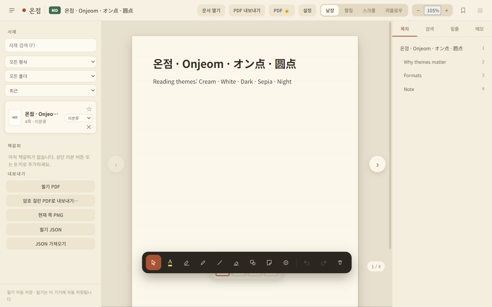
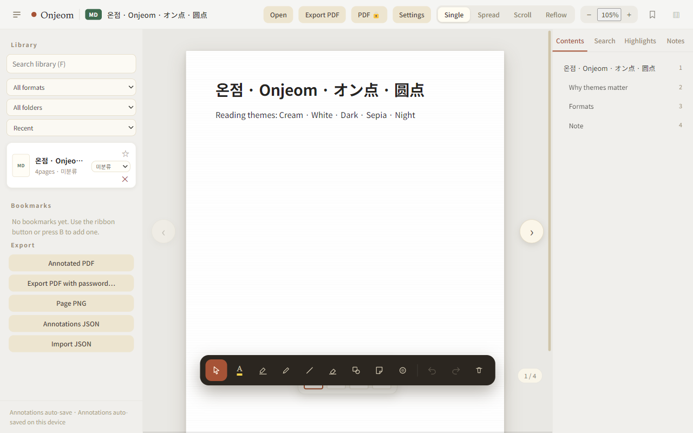
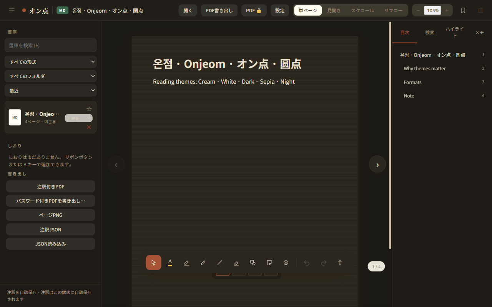
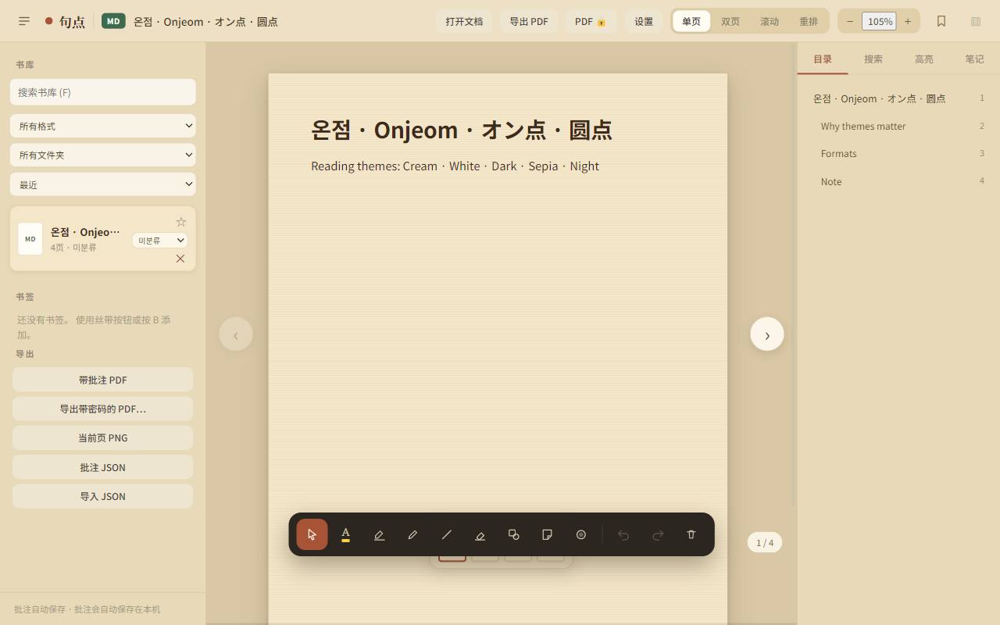

# Onjeom — Nederlands

**v0.4.11** · Multi-format document viewer with freehand annotation.  
**License:** MIT · **Repo:** [simhanson123/Onjeom_Doc_Viewer](https://github.com/simhanson123/Onjeom_Doc_Viewer)

- [User guide](./USER_GUIDE.md)
- [Build](./BUILD.md)
- [All languages](../README.md) · [English (canonical)](../en/README.md) · [한국어](../ko/README.md)

## Highlights (v0.4.11)

- **Formats:** MD · TXT/ASC · HTML · PDF · DOCX · PPTX · EPUB  
- **Encrypted PDF:** open with password; export annotated PDF **with** optional open-password  
- **Export PDF** from MD/HTML/DOCX keeps Hangul/CJK (canvas path — not broken Helvetica)  
- **Annotations never rewrite the source file** — ink is sidecar/device storage; export merges into a **new** PDF only  
- **Sync status** in the sidebar footer (saving / saved / failed + **Retry**)  
- **Contents (TOC)** jumps to page/heading  
- **Library remove** removes from the in-app list only — **never deletes** the original file on disk  
- **20 UI languages** · world-script body fonts  
- Empty library at start (no sample books)  
- **QA (developers):** vitest unit suite · GitHub Actions tests + coverage badge

## Formats & encodings (v0.4.11)

| Format | Extensions | Notes |
|--------|------------|--------|
| Markdown | `.md` `.markdown` | Headings, lists, code; TOC from headings |
| Plain text | `.txt` `.text` `.asc` `.ascii` `.log` `.csv` … | Encoding auto-detect |
| HTML | `.html` `.htm` | Structured reading (not raw tags) |
| PDF | `.pdf` | pdf.js canvas; **encrypted PDFs** open with password dialog |
| Word | `.docx` | OOXML via mammoth |
| PowerPoint | `.pptx` | One slide ≈ one page |
| EPUB | `.epub` | Chapters paginated |

**Text encodings:** ASCII · UTF-8 (±BOM) · UTF-16 · Windows-1252 · EUC-KR/CP949 · Shift_JIS · GBK · Big5 · Windows-1251/1256 · …

Open with **Open** / `Ctrl+O` or drag-and-drop. Use **All files** for unusual extensions.

## Install (Windows)

1. [Releases](https://github.com/simhanson123/Onjeom_Doc_Viewer/releases) → **v0.4.11+**
2. Installer (`Onjeom-*-win-x64.exe`) or portable (`Onjeom-*-win-portable.exe`)
3. **Open** / `Ctrl+O` — MD, TXT, HTML, PDF, DOCX, PPTX, EPUB, …

Library starts **empty** (no sample books).

## Screenshots — themes (colors)

| Cream · 한국어 | White · English |
|----------------|-----------------|
|  |  |

| Dark · 日本語 | Sepia · 简体中文 |
|---------------|------------------|
|  |  |

Album: [screenshots/](../screenshots/README.md)

## Develop

```bash
npm install
npm run test:loaders
npm run dev
npm run electron:build:win
npm run release:win
```

## Why a document might not show

| Format | Notes |
|--------|--------|
| PDF | Needs v0.4.11+ (`onjeom://` + pdf.js worker IPC) |
| Encrypted PDF | Password dialog |
| TXT / MD / ASC / HTML | Multi-encoding auto-detect |
| DOCX / PPTX / EPUB | ZIP + extract |
| TOC / library remove / CJK PDF export | Use v0.4.11+ |

Diagnostics: **Help → Path diagnostics**, **View → Developer tools** (`[onjeom]` logs).

Full detail: [en/USER_GUIDE](../en/USER_GUIDE.md) · [en/BUILD](../en/BUILD.md) · [ko/](../ko/README.md)

## UI language

**Settings → Language** — 20 locales including Nederlands.

## License

[MIT](../../LICENSE)
